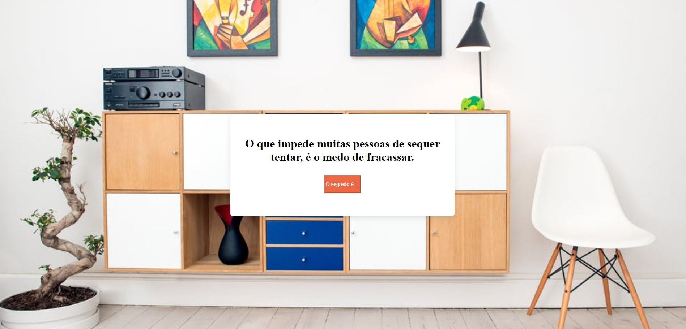

<h1 align="center">Projeto Modal </h1>

<h2 align="center">Aprendizados nesse projeto 🎯</h2>
O objetivo é continuar treinando e aprofundando os conhecimentos em HTML5, CSS3 e Vanilla JavaScript. 
Com esse projeto aprendi sobre as propriedades place-items, visibility e z-index.

<h2 align="center">Tecnologias utilizadas 🛠</h2>  

<h2 align="center">Deploy 👨🏽‍💻</h2>
<a href="" target="_blank">Descubra o segredo</a>

<h2 align="center"> Print do projeto </h2>
 

